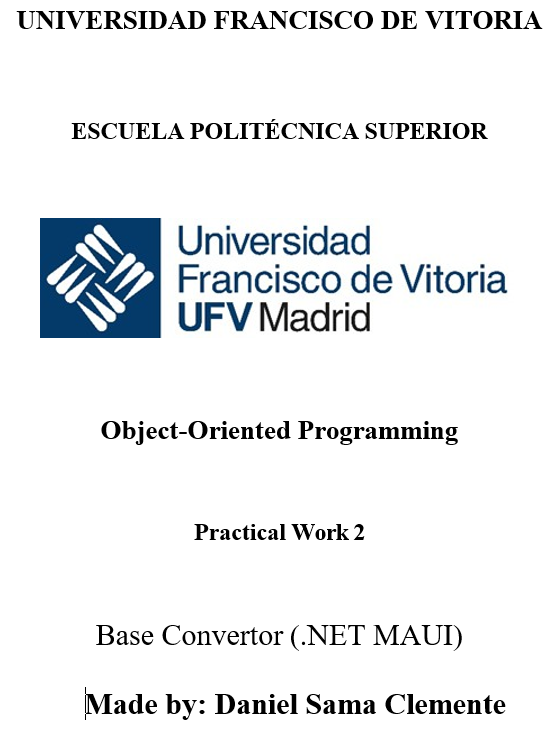

# practical_work_ii_oop 

## 1. COVER

  

## 2. TABLE OF CONTENTS

- [1. COVER](#1-cover)
- [2. TABLE OF CONTENTS](#2-table-of-contents)
- [3. INTRODUCTION](#3-introduction)
- [4. DESCRIPTION](#4-description)
 - [4.1. PROPOSED SOLUTION](#41-proposed-solution)
 - [4.2. CLASS DIAGRAM](#42-class-diagram)
 - [4.3. DEVELOPMENT COSIDERATIONS](#43-development-cosiderations)
 - [5. PROBLEMS & CHALLENGES](#5-problems--challenges)
- [6. CONCLUSIONS](#6-conclusions)
 - [6.1. LESSONS LEARNED](#61-lessons-learned)
 - [6.2. EFFECTIVENESS](#62-effectiveness)
 - [6.3. INSIGHTS GAINED](#63-insights-gained)
- [7. TIMELINE OF DEVELOPMENT](#7-timeline-of-development) 

## 3. INTRODUCTION 

This documents shows all of the information regarding on how using OOP principles (with the code of the Acitivities performed during the course) and with the .NET MAUI Enviroment, a program resembling a base convertor from one base to another. But instead of interacting with the program through the console a GUI (throught the .NET MAUI Enviroment) has been made to make a clear and organized paged in which the user interaction is simplier. 

## 4. DESCRIPTION 

### 4.1 PROPOSED SOLUTION

To explain the program it should be divided into 2 parts: 

- 1.THE MAUI CODE: 

This part includes in the creation of the different pages: 

**LOGIN PAGE**: 1st page which shows once the application is lauched where the user put their usernames and their respective password. If they have no account they can click the Register Link, also they can recover their password if they don't know their password by clicking in the Forgot Password Link. 

**REGISTER PAGE**: Here the new users can put in their details and create their account if there is data that exists like (username or email), it shows an error which shows that the data already exists to avoid any further problems. The user can go back to the Login when he pleases to do so. Futhermore details about how the password are created will be explain in the implementations page.  

**RECOVER PAGE**: Here the, already registers, users can recover and change the password, if the data entered does not match an already existing user an error is launched and nothing, if the data matched then special features as asked to change the password like on the RegisterPage. 

**CONVERSOR PAGE**: This page could be called the calculator page, this is the page where the conversions are performed, some instructions are shown to shown how to use the conversor. From this page the user will be able to logout from the Conversor and also click on the Operations Page. 

**OPERATIONS PAGE**: This page shows the user infomartion with all of the details and also how many operations the user has performed on the conversor. The user is able to go back to the conversor and also logout of the current sessions he is on. 

- 2.THE ACTIVITY VII CODE: 

**CONVERSION RELATED CLASES**: (EJ: DecimalToHexadecimal, TwosComplementToDecimal). This classes handle the numerical conversions between the different bases. 

**INPUT VALIDATION CLASES**: (EJ: BinaryInputValidator, OctalInputValidator). This classes verify that the input given from the user is correct for the correct conversion, otherwise an error will shown in the screen.

**COORDINATION / LOGIC CLASSES**: (EJ. Conveter, Conversion). This classes handle the flow and logic of the program. 

**OTHER CLASSES**: (EJ: Operations). This classes keep track of all of the conversions done, inputs, outputs, erros and the conversions made. 

### 4.2 CLASS DIAGRAM 

  

### 4.3 DEVELOPMENT COSIDERATIONS 

- We needed to use the classes from the Activities we have been doing thorugh the course. It what up to use to change or use the same solution and implement it from the GUI program. 

- We needed to use the MAUI environment to create the GUI for the user. 

- This project had to be done individually.

- Thread.Sleep(0) and Environment.Exit(0) methods are allowed for the flow of the program. 

## 5. PROBLEMS & CHALLENGES

- I had some trouble with how to pass the number of bits neccessary for when converting a number to binary given that the number of bits was done from the Activities' code to be passed down through a Console.ReadLine(), so what I did was to use a pop-up message in where to put the number of bits. Once this was done I also had a problem to how to exactly use the amount of bits neccessary for each conversion. So I decided to do an approach where the options of bits available are either 8, 16 or 32. This way this is best way to do this and it is a standart approach. 

- I also had a problem when making the conversion when doing the deciaml to another type of base. The result of this was when I inputted a number the program just froze and I could not figure out what was the problem, so I went back to all of the code execution and realized a made a typo in all of the DecimalTo... classes and I simply changed this and the code worked perfectly once this changed. 

- I also had trouble with passing down negative values for the Decimal to TwosComplement, I simply just changed the signature and behaviour of the override Change method in the DecimalToTwosComplement classes. Once this was done it worked perfectly for negative integers. 

- Finally the part which was the most annoying for me was the fact that I could not get the correct path for the users.csv where all of the data from the users is stored, given that in MAUI it was different so I first tried to fix it myself but that went nowhere, so they I just look online for tutorials and found out that the solution was simple so I just made the correct string and it worked perfectly. 

## 6. CONCLUSIONS 

### 6.1. LESSONS LEARNED

- Learned how to use MAUI: The last program I built was for a GUI was using the Windows Forms Enviroment. 
- Importance of bit-size validation methods in binary-based operations.

### 6.2. EFFECTIVENESS

The final program correctly performs all expected tasks:

- Handles full login/register/recovery workflow.
- Tracks, and futhermore it updates the user operation count.
- Converts across multiple different number base modes.
- Uses clear UI feedback for every possible errors.

### 6.3. INSIGHTS GAINED

- Designing clean, modular code in a graphical app involves many small parts that must work together correctly. Therefore I think that MAUI may be a strong developing environment but it is very difficult to learn. 
- Unit testing for each conversion class individually can simplify debugging across the app.

## 7. TIMELINE 

### 14/05/2025 ###

Created the repo

Created the folders neccessary. 

Created and made some corrections on all of the pages needed of the program. 

### 15/05/2025 ###

Created the users.csv file for storing the user crendentials.

Added a user on the csv file through the program. 

Completed the Login Page so now any users registered will be able to use the calculator. 

Completed the Register Page so now any new users will be able to register themselves to use the calculator. 

### 16/05/2025 ###

Corrected minor changes in the Register Page and Login Page. 

Created the Recovery Page design. 

Updated changes in Login, Conversor and Operations Page to make sure that the user's data is printed in 
the page. 

### 17/05/2025 ###

Added the neccessary files for the conversor to work. 

### 18/05/2025 ###

Fixed a typo in Decimal Files which prevented the conversions from working. 

Removed the texbox for the bits and instead made a pop-up for the operations which require the bits values. 

Added changed to allow negative integers to be converted into Two's Complement. 

Added method for the converting buttons in the ConverserPage. 

Added instructions for the coverser. 

Completed the documentation of the README.md file
